#Task

Try to get the two flags! Root the machine and prove your understanding of the fundamentals! This is a virtual machine meant for beginners. Acquiring both flags will require some basic knowledge of Linux and privilege escalation methods.

#Enumeration

We start with a normal nmap scan for all ports.

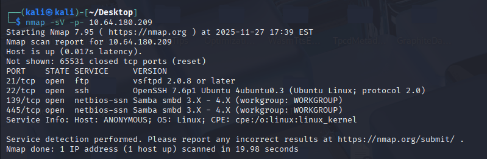

Now we can answer most of the questions in the task. And let's try the smbclient since the task asked us for a share name.

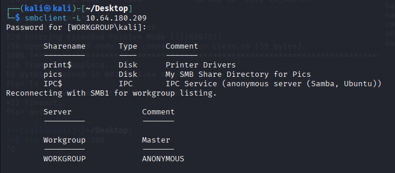

 I noticed that ftp is opened in nmap scan result. Maybe we can try ftp?

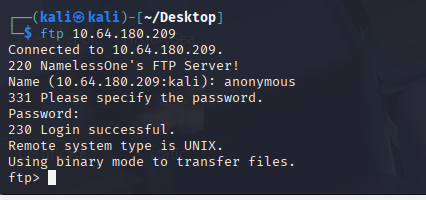

Well done! I tried ftp with username and password anonymous and success.

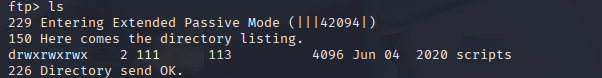

Well, a surprise. I assume we can write and read and execute the file here.

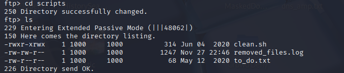

We cd to the scripts directory to check the files here.

After get the file and view the contents, I think they may be cron jobs.

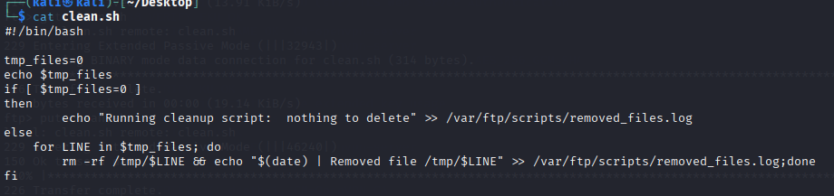

And I have read, write access to the directory. So let's put a reverse shell in clean.sh. 

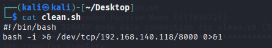

I nano a clean.sh on my own machine, and then put this file into the target throug ftp.

And then start a listener.

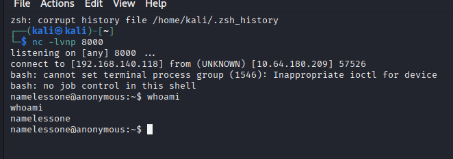

Now we are in.

#Escalation privlege

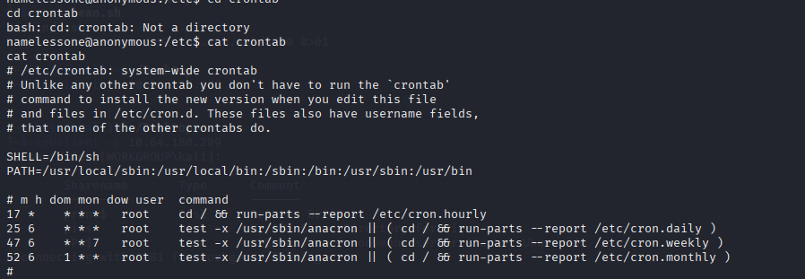

We check the cronjob, but no cron is availble.

Then we check the sudo command with sudo -l. However, no sudo availble.

Let's check the suid.

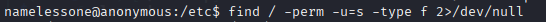

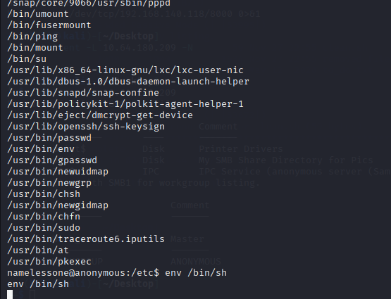

We find an interesting thing. /usr/bin/env is here. We search on GTFO bins and now we know how to use it.

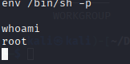

Now we are root.

Thanks for reading.

